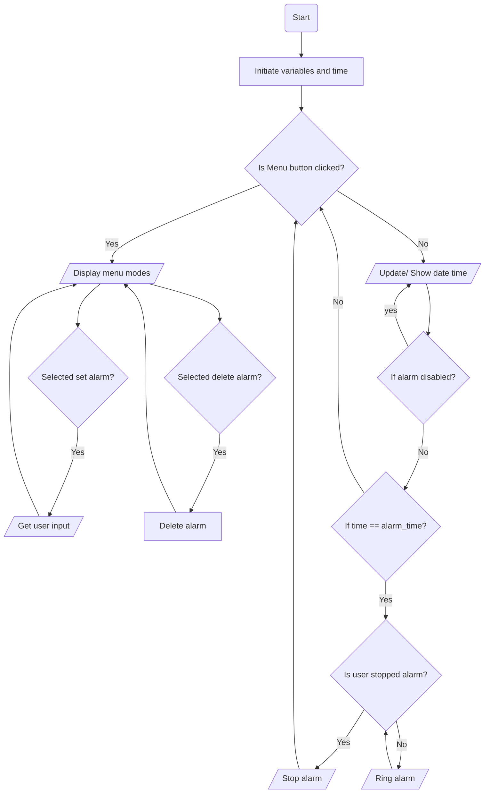
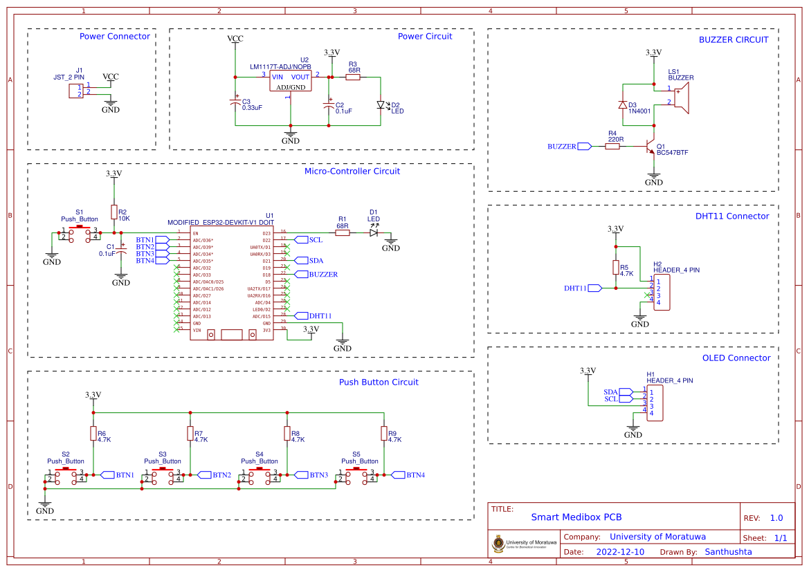
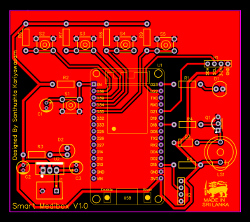
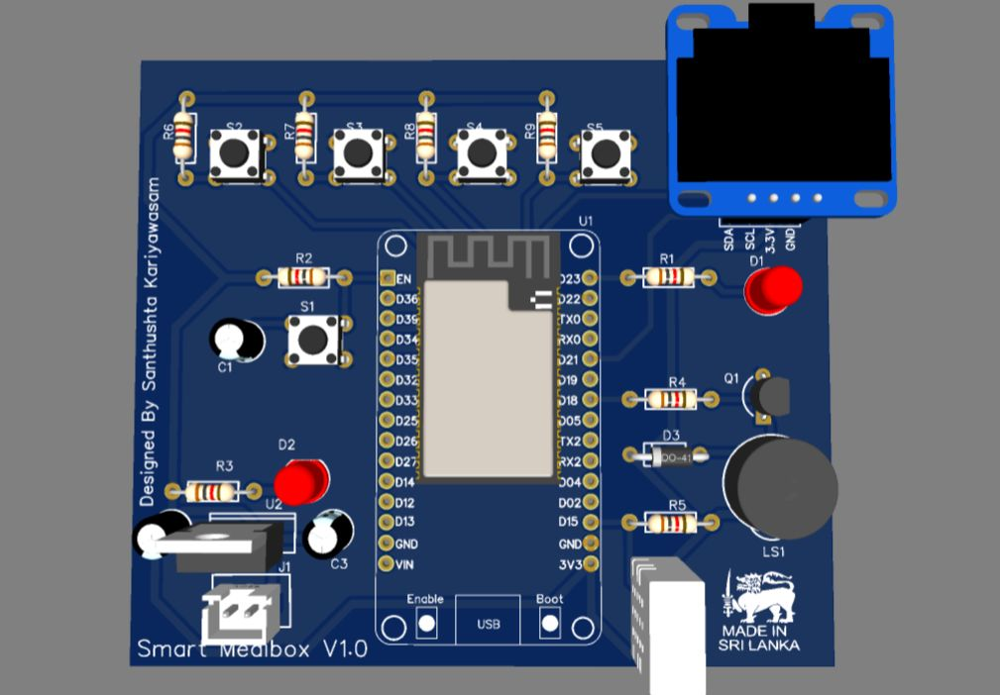
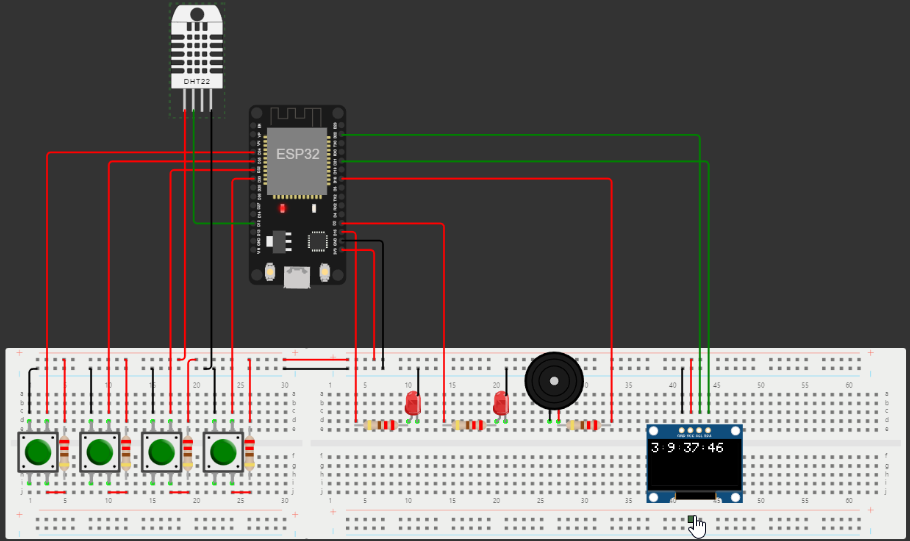
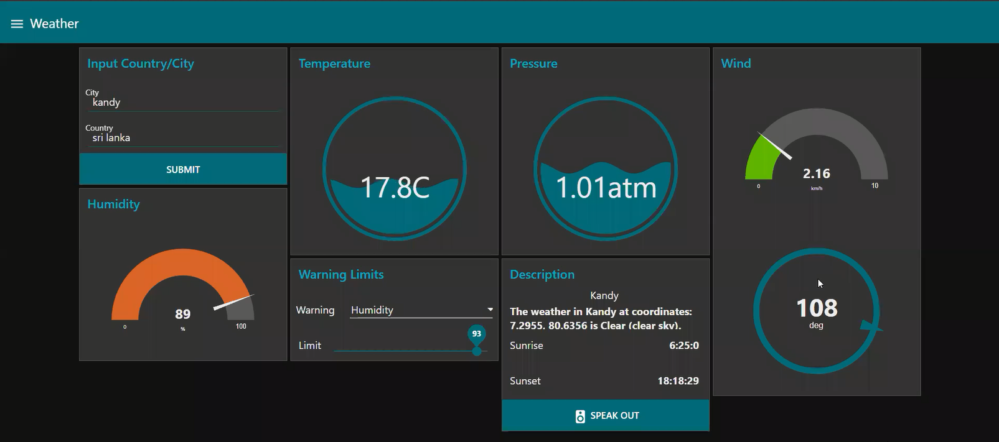

# Smart-Medibox

Hi! This project consist of two parts. Developing printed circuit board and developing smart-medibox algorithm.
Printed circuit board is developed using EasyEDA CAD tool & algorithm is developed using Arduino IDE with ESP32 Micro controller.

## Methodology

- Following approach is taken to design the hardware.
	- Requirement - Creating medicine dosage providing device for elderly people.
	- Features - LCD display for user to interact, Set medicine time, Alarm functions, Real time date update, Humidity & temperature warnings for medicine safety.
	- Hardware components - ESP32 micro controller, 128x64 OLED display, DHT11 humidity sensor, 3.3V voltage regulator
	- PCB design - EasyEDA

- Algorithm design
	- Rough flow chart of functionality is in below diagram.

## System Design & Implementation

### Hardware Design

- On EasyEDA following schematic diagram was made with selected components for the project.

- After that we can design the layout according to our PCB size constraints & component placement & routing best practices.

- Finally we can view in 3D with inbuild functionality of EasyEDA.

- EasyEDA Project is shared in https://oshwlab.com/skwin95/smart-medibox link.
- Gerber files can be generated once after we complete this design. These files are in **Printed Circuit Board** folder. 

### Algorithm Design

- Designed algorithm can be found in **Wokwi Simulation** folder
- Further simulation can be found in https://wokwi.com/projects/351656828982002263 Link

### Extras

- A demo IoT app using NodeRED platform can be found in **NodeRed IOT App** folder.

